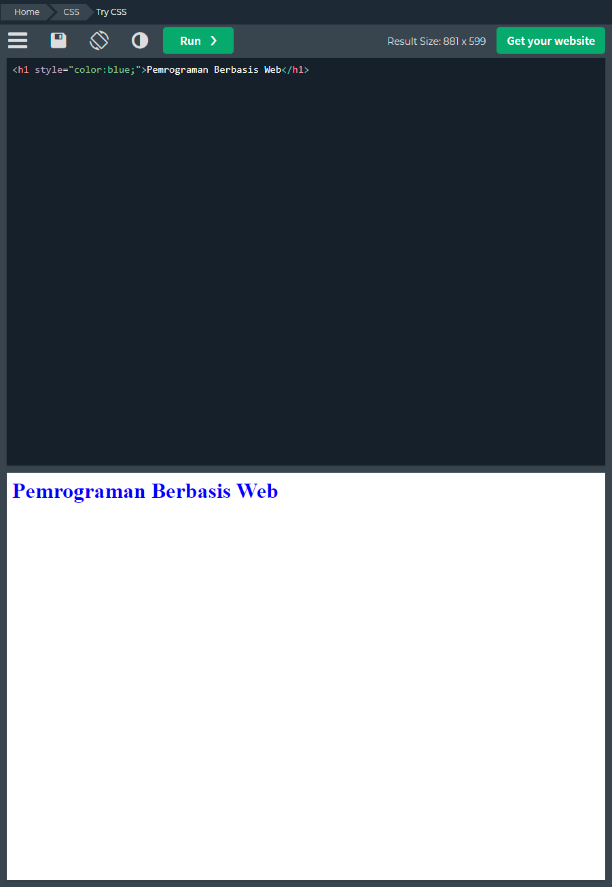
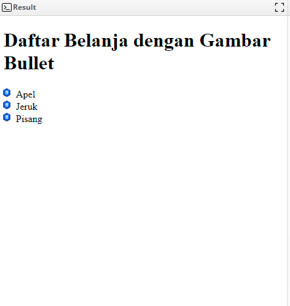

## Daftar Isi

- [Tujuan Pembelajaran](#tujuan-pembelajaran)
- [Apa itu CSS ?](#apa-itu-css-)
  - [Syntax](#syntax)
- [Selectors](#selectors)
  - [1 - Selector Element](#1---selector-element)
  - [2 - Selector ID](#2---selector-id)
  - [3 - Selector Class](#3---selector-class)
  - [4 - Selector Universal](#4---selector-universal)
  - [5 - Selector Group](#5---selector-group)
  - [6 - Selector Descendant](#6---selector-descendant)
  - [7 - Selector Child](#7---selector-child)
- [Inserting CSS](#inserting-css)
- [Comment](#comment)
- [Colors](#colors)
- [Background](#background)
- [Borders](#borders)
  - [1. Properti Border](#1-properti-border)
  - [2. Jenis Border](#2-jenis-border)
  - [3. Ukuran Border](#3-ukuran-border)
  - [4. Warna Border](#4-warna-border)
- [Margin](#margin)
- [Padding](#padding)
- [Height \& Width](#height--width)
- [Text](#text)
  - [1. font-family](#1-font-family)
  - [2. font-size](#2-font-size)
  - [3. font-weight](#3-font-weight)
  - [4. text-align](#4-text-align)
  - [5. line-height](#5-line-height)
- [Link](#link)
  - [1. color](#1-color)
  - [2. text-decoration](#2-text-decoration)
  - [3. hover](#3-hover)
  - [4. visited](#4-visited)
  - [5. active](#5-active)
- [List](#list)
  - [1. list-style-type](#1-list-style-type)
  - [2. list-style-image](#2-list-style-image)
  - [3. list-style-position](#3-list-style-position)
- [Table](#table)
  - [1. border-collapse](#1-border-collapse)
  - [2. border-spacing](#2-border-spacing)
  - [3. background-color](#3-background-color)
  - [4. text-align](#4-text-align-1)
  - [5. font-size](#5-font-size)
- [Display](#display)
  - [1 - Block](#1---block)
  - [2 - Inline](#2---inline)
  - [3 - None](#3---none)
- [Case Study](#case-study)
    - [Studi Kasus: Membangun Halaman Web Portofolio Pribadi](#studi-kasus-membangun-halaman-web-portofolio-pribadi)
- [Referensi](#referensi)
  

# Tujuan Pembelajaran

**Setelah praktikum ini dilakukan Anda diharapkan dapat:**

1. **Memahami Konsep Dasar**
   - Menjelaskan pengertian CSS dan peranannya dalam desain web.

2. **Menggunakan Selektor dan Properti**
   - Menggunakan berbagai jenis selektor untuk menerapkan gaya pada elemen HTML dan memahami cara kerja setiap properti CSS.

3. **Menerapkan Layout yang Efektif**
   - Mengatur layout halaman web dengan menggunakan teknik CSS seperti flexbox dan grid, serta mengelola ruang antar elemen.

4. **Mengubah Tipografi dan Warna**
   - Memilih dan menerapkan tipografi serta skema warna yang sesuai untuk meningkatkan estetika dan keterbacaan halaman web.

5. **Menciptakan Desain Responsif**
   - Menggunakan media queries untuk membuat desain yang responsif dan adaptif terhadap berbagai ukuran layar.

6. **Praktik Pengembangan Proyek**
   - Menerapkan CSS dalam proyek nyata, mulai dari pengaturan struktur file hingga implementasi gaya yang konsisten.

7. **Menggunakan Alat Debugging**
   - Menggunakan alat pengembang di browser untuk mendiagnosis dan memperbaiki masalah dalam kode CSS.

8. **Mengikuti Praktik Terbaik**
   - Menulis kode CSS yang bersih, terstruktur, dan sesuai dengan standar industri, meningkatkan kolaborasi dalam proyek pengembangan web.

# Apa itu CSS ?

CSS adalah singkatan dari cascading *style sheets*, yaitu bahasa yang digunakan untuk menentukan tampilan dan format halaman website. Dengan CSS, Anda bisa mengatur jenis font, warna tulisan, dan latar belakang halaman.

CSS digunakan bersama dengan bahasa markup, seperti HTML dan XML untuk membangun sebuah website yang menarik dan memiliki fungsi yang berjalan baik.

CSS juga berguna untuk mengatasi keterbatasan HTML dalam mengatur format halaman website. Kenapa demikian?

Apabila hanya menggunakan HTML ketika membangun website dengan beberapa halaman, Anda harus menulis tag untuk sebuah elemen HTML di semua halaman tersebut.

Dengan adanya CSS, Anda cukup menulis kode satu kali untuk sebuah elemen HTML untuk diterapkan ke semua halaman. Nantinya, ketika akan melakukan perubahan, Anda juga cukup melakukan perubahan pada satu kode tadi. Praktis, bukan? 🔥

Pun demikian, CSS sering dianggap sebagai sebuah bahasa pemrograman. Padahal, CSS lebih tepat disebut sebagai bahasa style sheet yang umumnya digunakan bersamaan dengan JavaScript

## Syntax

CSS sendiri memiliki sebuah syntax pasti yang dimilikinya, yaitu pemilihan tag dan deklarasi , tag disini berperan sebagai sebuah element yang ingin kita tambahkan sebuah style sedangkan deklarasi merupakan style style yang kita gunakan didalam tag yang telah kita pilih. contoh :

````html
<!doctype html>
<html>
<head>
  <style>
    p {
      color: blue;
    }
  </style>
</head>
<body>
  <p>Pemrograman Berbasis Web</p>
</body>
</html>
````


Perhatikan pada kode di atas, tag `<p>` merupakan sebuah element tag yang ingin kita tambahkan sebuah style sedangkan `color: blue` merupakan deklarasi style yang kita buat.

Pada penulisan deklarasi itu sendiri dipisah lagi menjadi 2 bagian yaitu `property` dan `value`. Pada contoh di atas, `color` merupakan sebuah `property` dan `blue` merupakan sebuah `value`.

# Selectors

1. Selector Element
2. Selector ID
3. Selector Class
4. Selector Universal
5. Selector Group
6. Selector Descendant
7. Selector Child

CSS `selectors` adalah cara untuk memilih elemen HTML yang akan diberi style atau tampilan pada halaman web. Dalam CSS, ada beberapa jenis `selectors` yang dapat digunakan untuk memilih elemen HTML, yaitu :

## 1 - Selector Element

Selector Element digunakan untuk memilih elemen HTML berdasarkan `nama element` Contoh:

```css
/* Mengatur style pada elemen h1 */
h1 {
  color: blue;
}
```

## 2 - Selector ID

*Selector ID* digunakan untuk memilih elemen HTML dengan *atribut id*. Setiap atribut id harus unik pada halaman web. Contoh:

```css
/* Mengatur style pada elemen dengan id "header" */
#header {
  background-color: gray;
}
```

## 3 - Selector Class

Selector *Class* digunakan untuk memilih elemen HTML dengan *attribut class*. Setiap atribut class dapat digunakan pada beberapa elemen HTML. Contoh:

```css
/* Mengatur style pada elemen dengan class "teks" */
.teks {
  font-size: 16px;
}
```

## 4 - Selector Universal

Selector *Universal* digunakan untuk memilih semua elemen HTML pada halaman web. Contoh:

```css
/* Mengatur margin dan padding pada semua elemen HTML */
* {
  margin: 0;
  padding: 0;
}
```

## 5 - Selector Group

Selector *Group* digunakan untuk memilih beberapa elemen HTML dengan properti yang sama. Contoh:

```css
/* Mengatur style pada elemen h1 dan h2 */
h1, h2 {
  color: red;
}
```

## 6 - Selector Descendant

Selector *Descendant* digunakan untuk memilih elemen HTML yang berada di dalam elemen HTML lainnya. Contoh:

```css
/* Mengatur style pada elemen p yang berada di dalam elemen div */
div p {
  font-weight: bold;
}
```

## 7 - Selector Child

Selector *Child* digunakan untuk memilih elemen HTML yang menjadi anak langsung dari elemen HTML lainnya. Contoh:

```css
/* Mengatur style pada elemen ul yang menjadi anak langsung dari elemen div */
div > ul {
  list-style: none;
}
```

# Inserting CSS

Css sendiri memiliki 3 cara dalam penggunaanya terhadap HTML yaitu : `inline`, `internal` dan `external`. pada penggunaan `Inline` berarti `css` yang dimasukan langsung kedalam `element` HTML, sedangkan `internal` berarti `css` yang dimasukan di letakan pada element `<head>`, dan yang terakhir `external` berarti `css` yang dimasukan berdasarkan sebuah `link external css`.

Contoh :

- Inline CSS

  ```css
  <h1 style="color:blue;">Pemrograman Berbasis Web</h1>
  ```

  Pada kode diatas, kita langsung menambahkan sebuah attribute `style` pada element `<h1>` kita.

  
- Internal CSS

```html
  <!DOCTYPE html>
<html>
  <head>
    <style>
      h1{
        color: blue;
      }
    </style>
  </head>
  <body>
    <h1>Pemrograman Berbasis Web</h1>
  </body>
</html>
```

Pada kode diatas, kita membuat sebuah `style` tepat pada tag `<head>` yang kita miliki.


- External Css

```html
<!DOCTYPE html>
<html>
  <head>
    <link rel="stylesheet" href="styles.css">
  </head>
  <body>
    <h1>Pemrograman Berbasis Web</h1>
  </body>
</html>
```

Pada Kode diatas, kita menggunakan `link rel="stylesheet" href="style.css"` pada `element <head>` kita sebagai penghubung antara HTML dan CSS kita.

```html
<!-- file style.css -->
h1 {
  color: blue;
}
```

Pada kode diatas, merupakan *file* dengan nama `style.css` yang kita siapkan terpisah, kemudian kita gunakan file tersebut untuk kita gunakan pada file HTML kita.


# Comment

Pada CSS kita juga dapat menuliskan sebuah kalimat / kata yang ingin kita tulis sebagai dokumentasi sebuah kode yang kita miliki akan tetapi kalimat / kata tersebut tidak di tampilkan pada halaman web disebut *comment*, penggunaan tag comment sendiri cukup sederhana yaitu : `/* tulis komentar anda */`

Contoh:

```html
<!DOCTYPE html>
<html>
  <head>
    <style>
    p {
      color: blue; /* set text bewarna biru */
    }
    </style>
  </head>
  <body>
  	<p>Pemrograman Berbasis Web</p>
  </body>
</html>
```


# Colors

Pada CSS kita juga dapat menambahkan sebuah warna pada element yang ingin kita tambahkan warna, penulisan warna dalam CSS cukup sederhana bisa berdasarkan warna itu sendiri ataupun `hex value` dari warna tersebut.

Contoh :

```html
<!DOCTYPE html>
<html>
   <head>
      <style>
         .warna {
         color: lightskyblue; /* Set text warna lightskyblue */
         }
         .hex{
         color: #B0C4DE /* Set text hex value warna */
         }
      </style>
   </head>
   <body>
      <p class="warna"> Pemrograman Berbasis Web - Belajar CSS Warna </p>
      <p class="hex"> Pemrograman Berbasis Web - Belajar CSS Warna menggunakan hex value warna</p>
```


# Background

Pada *CSS* `background` digunakan untuk menambahkan efek latar belakang untuk sebuah elemen, `CSS` `background` sendiri terdiri dari beberapa properti diantaranya :

- `background-color` (Membuat latar belakang memiliki warna)
- `background-image` (Menambahkan gambar di latar belakang)
- `background-repeat` (Membuat perulangan gambar yang ditampilkan baik dari *horizontal* maupun *vertikal*, hanya bisa digunakan dengan `background-image`)
- `background-attachment` (Membuat latar belakang bisa di *scroll* atau bersifat *fixed*)

**Contoh:**

```html
<!DOCTYPE html>
<html>
   <head>
      <style>
         body {
         background-color: lightblue; /*Background color for page */
         }
      </style>
   </head>
   <body>
      <h1>Hello World!</h1>
      <p>This page has a light blue background color!</p>
   </body>
</html>
```


```html
<!DOCTYPE html>
<html>
   <head>
      <style>
         body {
         background-image: url("paper.gif"); /* Background image for page */
         }
      </style>
   </head>
   <body>
      <h1>Hello World!</h1>
      <p>This page has an image as the background!</p>
   </body>
</html>
```


```html
<!DOCTYPE html>
<html>
   <head>
      <style>
         body {
         background-image: url("img_tree.png");
         background-repeat: no-repeat; /* CSS Background Image Repeat */
         background-position: right top;
         margin-right: 200px;
         }
      </style>
   </head>
   <body>
      <h1>Hello World!</h1>
      <p>Here, the background image is only shown once. In addition it is positioned away from the text.</p>
      <p>In this example we have also added a margin on the right side, so that the background image will not disturb the text.</p>
```


- *CSS background-attachment*

```css
/* Specify that the background image should be fixed: */

body {
  background-image: url("img_tree.png");
  background-repeat: no-repeat;
  background-position: right top;
  background-attachment: fixed;
}
```
```css
/* Specify that the background image should scroll with the rest of the page: */

body {
  background-image: url("img_tree.png");
  background-repeat: no-repeat;
  background-position: right top;
  background-attachment: scroll;
}
```
```html
<!DOCTYPE html>
<html>
   <head>
      <style>
         body {
         background-image: url("img_tree.png");
         background-repeat: no-repeat;
         background-position: right top;
         margin-right: 200px;
         background-attachment: fixed;
         }
      </style>
   </head>
   <body>
      <h1>The background-attachment Property</h1>
      <p>The background-attachment property specifies whether the background image should scroll or be fixed (will not scroll with the rest of the page).</p>
      <p><strong>Tip:</strong> If you do not see any scrollbars, try to resize the browser window.</p>
      <p>The background-image is fixed. Try to scroll down the page.</p>
      <p>The background-image is fixed. Try to scroll down the page.</p>
      <p>The background-image is fixed. Try to scroll down the page.</p>
      <p>The background-image is fixed. Try to scroll down the page.</p>
      <p>The background-image is fixed. Try to scroll down the page.</p>
      <p>The background-image is fixed. Try to scroll down the page.</p>
      <p>The background-image is fixed. Try to scroll down the page.</p>
      <p>The background-image is fixed. Try to scroll down the page.</p>
      <p>The background-image is fixed. Try to scroll down the page.</p>
      <p>The background-image is fixed. Try to scroll down the page.</p>
      <p>The background-image is fixed. Try to scroll down the page.</p>
      <p>The background-image is fixed. Try to scroll down the page.</p>
      <p>The background-image is fixed. Try to scroll down the page.</p>
      <p>The background-image is fixed. Try to scroll down the page.</p>
      <p>The background-image is fixed. Try to scroll down the page.</p>
      <p>The background-image is fixed. Try to scroll down the page.</p>
      <p>The background-image is fixed. Try to scroll down the page.</p>
      <p>The background-image is fixed. Try to scroll down the page.</p>
      <p>The background-image is fixed. Try to scroll down the page.</p>
      <p>The background-image is fixed. Try to scroll down the page.</p>
      <p>The background-image is fixed. Try to scroll down the page.</p>
      <p>The background-image is fixed. Try to scroll down the page.</p>
   </body>
</html>
```
# Borders

Pada CSS `borders` digunakan untuk menambahkan garis atau bingkai pada elemen HTML.

## 1. Properti Border

Properti border sendiri terdiri dari tiga bagian, yaitu jenis border `border-style`, ukuran border `border-with`, dan warna border `border-color`. Properti border juga dapat disingkat menjadi satu baris dengan menggunakan kode berikut:

```css
border : [ukuran] [jenis] [warna]
```
contoh penggunaan properti border sebagai berikut :

```css
/* Mengatur border pada elemen div dengan id "contoh" */
#contoh {
  border-style: solid;
  border-width: 2px;
  border-color: black;
}
```
## 2. Jenis Border
Jenis border pada CSS dapat diatur dengan properti `border-style`. Beberapa jenis border yang umum digunakan antara lain:

* `solid` - garis lurus dan solid.
* `dashed`: garis putus-putus.
* `dotted`: garis titik-titik.
* `double`: garis ganda.
* `groove`: garis bercorak tiga dimensi seperti terlihat dari dalam lubang.
* `ridge`: garis bercorak tiga dimensi seperti terlihat dari luar lubang.
* `inset`: garis bercorak tiga dimensi seperti terlihat masuk ke dalam lubang.
* `outset`: garis bercorak tiga dimensi seperti terlihat keluar dari lubang.

Contoh penggunaan jenis border:

```css
/* Mengatur border dengan jenis dashed */
#contoh {
  border-style: dashed;
}
```

## 3. Ukuran Border

Ukuran border pada CSS dapat diatur dengan properti `border-width`. Ukuran border dapat diatur dalam nilai `pixel (px)`, `presentase (%)`, atau ukuran lain seperti `thin`, `medium`, dan `thick`.

Contoh penggunaan ukuran border:

```css
/* Mengatur border dengan ukuran 2 piksel */
#contoh {
  border-width: 2px;
}
```

## 4. Warna Border

Warna border pada CSS dapat diatur dengan properti `border-color`. Warna border dapat diatur dengan nama warna seperti `red`, `blue`, dan `gree`n, atau dengan kode warna seperti `#ff0000`, #`0000ff`, dan `#00ff00`.

```css
/* Mengatur border dengan warna hitam */
#contoh {
  border-color: black;
}
```

```html
<!DOCTYPE html>
<html>
   <head>
      <style>
         body {
         background-color:#E7E9EB;
         }
         #myDIV {
         width:100%;
         height:300px;
         background-color:#FFFFFF;
         border:5px solid;
         border-style: dashed;
         }
      </style>
   </head>
   <body>
      <h1>The border-style Property</h1>
      <div id="myDIV">
         A demonstration on how to set the border style.
      </div>
   </body>
</html>
```
# Margin

*Margin* adalah ruang kosong yang berada di sekeliling elemen HTML. Dalam CSS, margin dapat diatur dengan properti `margin`.

Pada Margin kita dapat mengatur ukuran margin dengan nilai satuan `px`, `em`, atau `%`. *Margin* sendiri memiliki `4 properti` yaitu : `margin-top`, `margin-right`, `margin-left` dan `margin-bottom`.

contoh :

````css
/* Set margin yang berbeda untuk setiap sisi */
div {
	margin-left : 20px;
	margin-right: 10px;
	margin-top: 5px;
	margin-bottom: 40px:
}
````
```html
<!DOCTYPE html>
<html>
   <head>
      <style>
         p.ex1 {
         margin: 35px;
         }
      </style>
   </head>
   <body>
      <h1>The margin Property</h1>
      <p>A paragraph with no specified margins.</p>
      <p class="ex1">This paragraph has a margin of 35 pixels on all four sides.</p>
      <p>A paragraph with no specified margins.</p>
   </body>
```


Kita juga bisa membuat sebuah `shorthand code` untuk pembuatan *margin*, contoh nya sebagai berikut :

```css
/* Mengatur margin sebesar 10px untuk semua sisi */
div {
  margin: 10px;
}

/* Mengatur margin sebesar 10px untuk sisi atas dan bawah, dan 20px untuk sisi kiri dan kanan */
div {
  margin: 10px 20px;
}

/* Mengatur margin sebesar 10px untuk sisi atas, 20px untuk sisi kanan, 30px untuk sisi bawah, dan 40px untuk sisi kiri */
div {
  margin: 10px 20px 30px 40px;
}
```
```html
<!DOCTYPE html>
<html>
   <head>
      <style>
         p.ex1 {
         margin: 35px 70px 50px 90px;
         }
      </style>
   </head>
   <body>
      <h1>The margin Property</h1>
      <p>A paragraph with no specified margins.</p>
      <p class="ex1">This paragraph has a 35 pixels margin for top, a 70 pixels margin for right, a 50 pixels margin for bottom, and a 90 pixels margin for left.</p>
      <p>A paragraph with no specified margins.</p>
   </body>
</html>
```


Kita juga bisa menggunakan sebuah **propreti** `margin auto` untuk mengatur secara otomatis, sehingga elemen HTML akan berada di tengah secara horizontal. Contoh:

```css
/* Mengatur margin secara otomatis pada sisi kiri dan kanan, sehingga elemen HTML berada di tengah secara horizontal */
div {
margin: 0 auto;
}
```
```html
<!DOCTYPE html>
<html lang="id">
<head>
    <meta charset="UTF-8">
    <meta name="viewport" content="width=device-width, initial-scale=1.0">
    <title>Contoh Margin Auto</title>
    <link rel="stylesheet" href="styles.css">
</head>
<body>
    <div class="container">
        <h1>Selamat Datang!</h1>
        <p>Ini adalah contoh penggunaan margin: 0 auto; untuk menengahakan elemen.</p>
    </div>
</body>
</html>
```

**CSS (styles.css)**

```css
body {
    font-family: Arial, sans-serif;
    background-color: #f0f0f0;
    margin: 0;
    padding: 0;
}

.container {
    width: 50%; /* Mengatur lebar elemen */
    background-color: #fff; /* Warna latar belakang */
    padding: 20px; /* Jarak dalam elemen */
    box-shadow: 0 0 10px rgba(0, 0, 0, 0.1); /* Bayangan */
    margin: 0 auto; /* Mengatur margin atas/bawah 0 dan tengah secara horizontal */
}
```
**Penjelasan**

- `margin: 0 auto`; akan mengatur margin atas dan bawah menjadi 0, sementara margin kiri dan kanan otomatis. Ini membuat elemen `.container` berada di tengah halaman.
  
- Elemen .`container` memiliki lebar `50%` dari lebar jendela, sehingga bisa terlihat di tengah dengan baik.

# Padding

***Padding*** adalah ruang kosong yang berada di dalam elemen HTML, antara konten elemen dan border. Dalam CSS, padding dapat diatur dengan properti `padding`.

*Padding* sendiri hampir sama seperti *margin* kita dapat mengatur ukuran padding dengan nilai satuan `px, em,` atau `%`. `Padding` sendiri `memiliki 4 properti` yaitu : `padding-top, padding-right, padding-left dan padding-bottom`.

Contoh :

```css
/* Set padding yang berbeda untuk setiap sisi */
div {
  padding-top: 10px;
  padding-right: 20px;
  padding-bottom: 30px;
  padding-left: 40px;
}
```
Seperti halnya dengan `margin`, `padding` juga memiliki `shorthand code` untuk penulisannya, contoh 

```css
/* Mengatur padding sebesar 10px untuk semua sisi */
div {
  padding: 10px;
}

/* Mengatur padding sebesar 10px untuk sisi atas dan bawah, dan 20px untuk sisi kiri dan kanan */
div {
  padding: 10px 20px;
}

/* Mengatur padding sebesar 10px untuk sisi atas, 20px untuk sisi kanan, 30px untuk sisi bawah, dan 40px untuk sisi kiri */
div {
  padding: 10px 20px 30px 40px;
}
```
Contoh: Kita akan menambahkan elemen HTML dan CSS untuk menunjukkan efek padding pada sebuah `<div>`

```html
<!DOCTYPE html>
<html lang="id">
<head>
    <meta charset="UTF-8">
    <meta name="viewport" content="width=device-width, initial-scale=1.0">
    <title>Contoh Padding</title>
    <link rel="stylesheet" href="styles.css">
</head>
<body>
    <div class="box">
        <h2>Contoh Padding</h2>
        <p>Padding yang berbeda diterapkan di setiap sisi elemen ini.</p>
    </div>
</body>
</html>
```
**CSS (styles.css)**

```css
body {
    font-family: Arial, sans-serif;
    background-color: #f0f0f0;
    margin: 0;
    padding: 20px;
}

.box {
    background-color: #fff; /* Warna latar belakang */
    border: 1px solid #ccc; /* Border untuk kotak */
    
    /* Set padding yang berbeda untuk setiap sisi */
    padding-top: 10px;    /* Atas */
    padding-right: 20px;  /* Kanan */
    padding-bottom: 30px; /* Bawah */
    padding-left: 40px;   /* Kiri */
}
```
**Penjelasan**

Padding mengatur jarak antara konten dalam elemen dan batas elemen itu sendiri.
Di contoh ini:

- Padding atas: `10px`
- Padding kanan: `20px`
- Padding bawah: `30px`
- Padding kiri: `40px`

Anda akan melihat bahwa konten dalam `<div class="box">` memiliki jarak yang berbeda di setiap sisi, menciptakan efek yang menarik.

Silakan coba dan sesuaikan dengan preferensi Anda!

# Height & Width

Dalam CSS, `height` dan `width` adalah properti yang digunakan untuk mengatur ukuran suatu elemen. Properti ini sangat penting dalam membuat layout website yang responsif.

Pada `height` dan `width` kita dapat mengatur ukurannya dengan nilai satuan `px`, `em`, atau `%.`

Seperti halnya `margin` dan `padding`, `height` dan `width` juga menggunakan konsep `box model`. `Box model` terdiri dari `content, padding, border`, dan `margin`. Oleh karena itu, ukuran `height` dan `width` yang diatur melalui properti `height` dan `width` hanya akan mempengaruhi ukuran content dari suatu elemen. Jika ingin mengatur ukuran keseluruhan elemen, maka harus menambahkan ukuran `padding, border`, dan `margin`.

Contoh:

```css
/* Set height dan width beserta padding, border, dan margin */
div {
  height: 200px;
  width: 200px;
  padding: 20px;
  border: 2px solid black;
  margin: 10px;
}
```
```html
<!DOCTYPE html>
<html>
   <head>
      <style>
         div {
         height: 200px;
         width: 200px;
         padding: 20px;
         border: 2px solid black;
         margin: 10px;
         background-color: powderblue; 
         }
      </style>
   </head>
   <body>
      <h2>Set the height and width of an element</h2>
      <div>Set height dan width beserta padding, border, margin dan menambahkan background-color</div>
   </body>
</html>
```


Seperti halnya *margin* dan *padding*, `height` dan `width` juga memiliki `shorthand code` untuk mempermudah penulisan.

Contoh:

```css
/* Mengatur height dan width sebesar 200px */
div {
  height: 200px;
  width: 200px;
}

/* Mengatur height dan width sebesar 200px */
div {
  height: 200px;
  width: 200px;
}

/* Mengatur height sebesar 50% dari lebar elemen yang menjadi parent */
div {
  height: 50%;
  width: 100%;
}
```
Jika konten elemen lebih besar dari ukuran `height` dan `width` yang sudah kita atur, maka konten tersebut akan keluar dari elemen. Untuk mengatasi hal ini, dapat digunakan properti `overflow`.

contoh:

```css
/* Mengatur height dan width sebesar 200px dan menyembunyikan konten yang keluar dari elemen */
div {
  height: 200px;
  width: 200px;
  overflow: hidden;
}
```
Pada contoh di atas, konten yang keluar dari elemen akan disembunyikan. Ada juga nilai `scroll` yang dapat digunakan untuk menampilkan `scroll` bar jika konten melebihi ukuran elemen.

```css
/* Mengatur height dan width sebesar 200px dan menampilkan scroll bar jika konten melebihi ukuran elemen */
div {
  height: 200px;
  width: 200px;
  overflow: auto;
}
```

**Kode Lengkap**

```html
<!DOCTYPE html>
<html lang="id">
<head>
    <meta charset="UTF-8">
    <meta name="viewport" content="width=device-width, initial-scale=1.0">
    <title>Contoh Overflow Auto</title>
    <style>
        body {
            font-family: Arial, sans-serif;
            background-color: #f0f0f0;
            margin: 0;
            padding: 20px;
        }

        .box {
            height: 200px; /* Tinggi elemen */
            width: 200px;  /* Lebar elemen */
            overflow: hidden; /* Menyembunyikan konten yang melebihi batas */
            background-color: #fff; /* Warna latar belakang */
            border: 1px solid #ccc; /* Border untuk kotak */
            padding: 10px; /* Jarak dalam elemen */
            margin-bottom: 20px; /* Jarak antar elemen */
        }

        .box-auto {
            height: 200px; /* Tinggi elemen */
            width: 200px;  /* Lebar elemen */
            overflow: auto; /* Menampilkan scrollbar jika konten melebihi batas */
            background-color: #fff; /* Warna latar belakang */
            border: 1px solid #ccc; /* Border untuk kotak */
            padding: 10px; /* Jarak dalam elemen */
        }
    </style>
</head>
<body>
    <div class="box">
        <h2>Contoh Box (Overflow Hidden)</h2>
        <p>Ini adalah teks yang cukup panjang dan akan keluar dari batas elemen.</p>
    </div>
    
    <div class="box-auto">
        <h2>Contoh Box (Overflow Auto)</h2>
        <p>Ini adalah teks yang cukup panjang dan akan menampilkan scrollbar jika melebihi batas elemen. Lorem ipsum dolor sit amet, consectetur adipiscing elit. Vestibulum vel dolor vel enim efficitur posuere. Nulla facilisi.</p>
    </div>
</body>
</html>
```
**Penjelasan**

Dua Elemen Box:

- `.box` menggunakan `overflow: hidden;`, sehingga konten yang lebih panjang tidak terlihat.
  
- `.box-auto` menggunakan `overflow: auto;`, yang akan menampilkan `scrollbar` ketika konten melebihi tinggi elemen.

Anda dapat melihat *perbedaan cara kedua elemen menangani konten yang berlebih*.

Silakan coba jalankan kode ini di browser Anda!

# Text

`CSS text` properties digunakan untuk mengubah tampilan teks pada halaman web. Beberapa properti CSS text yang umum digunakan antara lain:

## 1. font-family

Properti `font-family` digunakan untuk menentukan jenis font yang akan digunakan pada teks. Nilai dari properti ini dapat berupa nama font atau kumpulan font.

Jika nama font yang diinginkan tidak terpasang pada perangkat pengguna, maka font alternatif yang disebutkan dalam nilai font-family akan digunakan.

contoh :

```css
/* font element p akan dirender menggunakan font "Helvetica Neue" */
p {
  font-family: "Helvetica Neue", Helvetica, Arial, sans-serif;
}
```

## 2. font-size

Properti `font-size` digunakan untuk menentukan ukuran font pada teks. Nilai dari properti ini dapat berupa satuan ukuran seperti `px`, `em`, atau `rem`.

```css
/* element h1 akan memiliki font size 36px */
h1 {
  font-size: 36px;
}

/* element p akan memiliki font size 1.2em */
p {
  font-size: 1.2em;
}
```

## 3. font-weight

Properti `font-weight` digunakan untuk menentukan ketebalan font pada teks. Nilai dari properti ini dapat berupa `angka` atau kata kunci seperti `bold`, `normal`, atau `lighter`.

```css
/* element h1 akan memiliki font weight bold */
h1 {
  font-weight: bold;
}

/* element p akan mimiliki font weight ukuran 300 */
p {
  font-weight: 300;
}
```

## 4. text-align

Properti` text-align` digunakan untuk menentukan rataan teks pada suatu elemen. Nilai dari properti ini dapat berupa `left, right, center`, atau `justify.`

```css
/* element h1 akan memiliki text align tengah */
h1 {
  text-align: center;
}

/* element p akan memiliki text align rata kanan kiri */
p {
  text-align: justify;
}
```

## 5. line-height

Properti `line-height` digunakan untuk menentukan jarak antara baris pada suatu teks. Nilai dari properti ini dapat berupa `angka` atau `persentase`.

Berikut adalah implementasi sederhana penggunaan berbagai `properti CSS` untuk `teks`, termasuk `font-family`, `font-size`, `font-weight`, `text-align`, dan `line-height`.

```html
<!DOCTYPE html>
<html lang="id">
<head>
    <meta charset="UTF-8">
    <meta name="viewport" content="width=device-width, initial-scale=1.0">
    <title>Contoh Penggunaan CSS Text</title>
    <style>
        body {
            font-family: Arial, sans-serif; /* Font default untuk seluruh halaman */
            background-color: #f0f0f0;
            margin: 0;
            padding: 20px;
        }

        .text-example {
            font-family: 'Georgia', serif; /* Jenis font */
            font-size: 24px; /* Ukuran font */
            font-weight: bold; /* Ketebalan font */
            text-align: center; /* Penjajaran teks */
            line-height: 1.5; /* Jarak antar baris */
            background-color: #fff; /* Warna latar belakang */
            padding: 20px; /* Jarak dalam elemen */
            border: 1px solid #ccc; /* Border untuk kotak */
            border-radius: 5px; /* Sudut yang membulat */
        }
    </style>
</head>
<body>
    <div class="text-example">
        <h2>Contoh Penggunaan CSS Text</h2>
        <p>Ini adalah contoh sederhana penggunaan properti CSS untuk teks.</p>
        <p>Anda dapat mengatur jenis font, ukuran, ketebalan, penjajaran, dan jarak antar baris.</p>
    </div>
</body>
</html>
```
**Penjelasan**

1. `font-family`: Mengatur jenis font yang digunakan. Dalam contoh ini, `Georgia` digunakan sebagai font untuk elemen dengan kelas `.text-example.`
2. `font-size`: Mengatur ukuran teks. Di sini, ukuran font diatur menjadi `24px.`
3. `font-weight`: Mengatur ketebalan teks. `bold` membuat teks menjadi lebih tebal.
4. `text-align`: Mengatur penjajaran teks. `center` membuat teks berada di tengah elemen.
5. `line-height`: Mengatur jarak antar baris. Di sini, jarak antar baris diatur menjadi` 1.5 kali ukuran font`, yang membuat teks lebih mudah dibaca.

Silakan coba jalankan kode ini di browser Anda!

# Link

`Link` dalam HTML digunakan untuk membuat tautan ke halaman web lain atau ke bagian lain pada halaman yang sama. CSS dapat digunakan untuk mengatur gaya dan tampilan link pada halaman web. Beberapa properti CSS link yang umum digunakan antara lain:

## 1. color

Properti `color` digunakan untuk menentukan warna teks pada link.

Contoh:

```css
/* warna teks pada semua link akan bewarna biru */
a {
  color: blue;
}
```

## 2. text-decoration

Properti `text-decoration` digunakan untuk menambahkan dekorasi pada link seperti garis bawah atau garis coret.

Contoh:

```css
/* pada semua link akan memiliki garis bawah */
a {
  text-decoration: underline;
}
```
## 3. hover

Properti `hover` digunakan untuk mengubah tampilan link ketika kursor mouse mengarah ke link tersebut.

## 4. visited

Properti `visited` digunakan untuk mengatur tampilan link yang telah dikunjungi oleh pengguna.

## 5. active

Properti `active` digunakan untuk mengatur tampilan link ketika link sedang ditekan.

Contoh:

```css
/* ketika link sedang ditekan akan memiliki warna hijau */
a:active {
  color: green;
}
```
Berikut adalah contoh implementasi sederhana penggunaan berbagai properti CSS untuk tautan (link), termasuk `color, text-decoration, hover, visited,` dan `active`.

```html
<!DOCTYPE html>
<html lang="id">
<head>
    <meta charset="UTF-8">
    <meta name="viewport" content="width=device-width, initial-scale=1.0">
    <title>Contoh CSS Link</title>
    <style>
        body {
            font-family: Arial, sans-serif;
            background-color: #f0f0f0;
            margin: 0;
            padding: 20px;
        }

        a {
            color: #3498db; /* Warna link */
            text-decoration: none; /* Menghapus garis bawah */
            font-weight: bold; /* Ketebalan font */
        }

        a:hover {
            color: #2980b9; /* Warna saat mouse hover */
            text-decoration: underline; /* Menambahkan garis bawah saat hover */
        }

        a:visited {
            color: #9b59b6; /* Warna link yang telah dikunjungi */
        }

        a:active {
            color: #e74c3c; /* Warna saat link diklik */
        }
    </style>
</head>
<body>
    <h1>Contoh Properti CSS Link</h1>
    <p>Untuk mencoba tautan di bawah ini, klik atau hover mouse di atasnya:</p>
    <a href="https://fti.unsap.ac.id">Kunjungi Fakultas Teknologi Informasi</a>
</body>
</html>
```
**Penjelasan**

1. `color`: Mengatur warna teks tautan. Pada contoh ini, warna tautan diatur menjadi biru `(#3498db)`.
2. `text-decoration`: Mengatur dekorasi teks. Di sini, garis bawah dihapus untuk tautan default dengan `text-decoration: none;`.
3. `hover:` Menggunakan `a:hover` untuk mengubah gaya tautan saat mouse berada di atasnya. Warna diubah menjadi lebih gelap `(#2980b9)`, dan garis bawah ditambahkan.
4. `visited`: Menggunakan `a:visite`d untuk mengubah warna tautan yang sudah dikunjungi. Di sini, warnanya diatur menjadi ungu `(#9b59b6`).
5. `active`: Menggunakan `a:active` untuk mengubah warna tautan saat tautan sedang diklik. Warna diatur menjadi merah `(#e74c3c)`.

Silakan coba jalankan kode ini di browser Anda!

# List

HTML menyediakan tiga jenis `list`, yaitu `ordered list` (daftar berurutan), `unordered list` (daftar tidak berurutan), dan `definition list` (daftar definisi). 

CSS dapat digunakan untuk mengatur tampilan `list` pada halaman web, seperti mengubah `jenis simbol`, `ukuran`, dan `jarak antar item dalam list`. Beberapa properti CSS list yang umum digunakan antara lain:

## 1. list-style-type

Properti `list-style-type` digunakan untuk menentukan jenis simbol pada list.

Contoh:

```css
.dari-bullet {
    list-style-type: square; /* Menggunakan kotak sebagai bullet */
}

.dari-huruf {
    list-style-type: upper-alpha; /* Menggunakan huruf kapital sebagai nomor */
}

.dari-angka {
    list-style-type: decimal; /* Menggunakan angka biasa sebagai nomor */
}
```
```html
<!DOCTYPE html>
<html lang="id">
<head>
    <meta charset="UTF-8">
    <meta name="viewport" content="width=device-width, initial-scale=1.0">
    <title>Contoh List Style Type</title>
    <link rel="stylesheet" href="styles.css">
</head>
<body>
    <h1>Daftar Belanja</h1>
    <ul class="dari-bullet">
        <li>Apel</li>
        <li>Jeruk</li>
        <li>Pisang</li>
    </ul>

    <h1>Daftar Tugas (Huruf)</h1>
    <ol class="dari-huruf">
        <li>Bangun pagi</li>
        <li>Makan sarapan</li>
        <li>Mulai bekerja</li>
    </ol>

    <h1>Daftar Tugas (Angka)</h1>
    <ol class="dari-angka">
        <li>Siapkan alat tulis</li>
        <li>Periksa jadwal</li>
        <li>Ikuti kelas</li>
    </ol>
</body>
</html>
```

Kode Lengkap (HTML dan CSS)

```html
<!DOCTYPE html>
<html lang="id">
<head>
    <meta charset="UTF-8">
    <meta name="viewport" content="width=device-width, initial-scale=1.0">
    <title>Contoh List Style Type</title>
    <style>
        .dari-bullet {
            list-style-type: square; /* Menggunakan kotak sebagai bullet */
        }

        .dari-huruf {
            list-style-type: upper-alpha; /* Menggunakan huruf kapital sebagai nomor */
        }

        .dari-angka {
            list-style-type: decimal; /* Menggunakan angka biasa sebagai nomor */
        }
    </style>
</head>
<body>
    <h1>Daftar Belanja</h1>
    <ul class="dari-bullet">
        <li>Apel</li>
        <li>Jeruk</li>
        <li>Pisang</li>
    </ul>

    <h1>Daftar Tugas (Huruf)</h1>
    <ol class="dari-huruf">
        <li>Bangun pagi</li>
        <li>Makan sarapan</li>
        <li>Mulai bekerja</li>
    </ol>

    <h1>Daftar Tugas (Angka)</h1>
    <ol class="dari-angka">
        <li>Siapkan alat tulis</li>
        <li>Periksa jadwal</li>
        <li>Ikuti kelas</li>
    </ol>
</body>
</html>
```


Penjelasan Tambahan

- `list-style-type: square;` pada elemen `<ul>` akan mengubah bullet menjadi kotak.
- `list-style-type: upper-alpha;` pada elemen `<ol>` akan mengubah angka menjadi huruf kapital (A, B, C, ...).
- `list-style-type: decimal;` pada elemen `<ol class="dari-angka">` akan menampilkan item dengan angka biasa (1, 2, 3, ...).

Dengan ini, anda sudah memiliki contoh `daftar dengan berbagai gaya penomoran!` Selamat mencoba!

## 2. list-style-image

Properti `list-style-image` digunakan untuk menentukan gambar yang digunakan sebagai simbol pada list.

Contoh: 

```css
/* pada list tidak berurutan (ul) menggunakan sebuah gambar dengan nama icon.png */
.dari-bullet {
    list-style-image: url('https://icons.iconarchive.com/icons/martz90/hex/16/css-3-icon.png'); /* Gambar sebagai bullet */
}

ul {
    padding-left: 20px; /* Memberi jarak pada daftar */
}
```

```html
<!DOCTYPE html>
<html lang="id">
<head>
    <meta charset="UTF-8">
    <meta name="viewport" content="width=device-width, initial-scale=1.0">
    <title>Contoh list-style-image</title>
    <link rel="stylesheet" href="styles.css"> <!-- Menghubungkan file CSS -->
</head>
<body>
    <h1>Daftar Belanja dengan Gambar Bullet</h1>
    <ul class="dari-bullet">
        <li>Apel</li>
        <li>Jeruk</li>
        <li>Pisang</li>
    </ul>
</body>
</html>
```

Cara Menggunakan

1. Buat dua file: satu untuk HTML `(index.html)` dan satu untuk CSS `(styles.css)`.
2. Pastikan gambar `icon.png` berada di lokasi yang sama dengan `file HTML dan CSS`. Atau anda bisa juga mengambil tautan gambar dari internet. seperti pada contoh kode di atas.
3. Tempelkan kode HTML di atas ke dalam file `index.html`.
4. Tempelkan kode CSS di atas ke dalam file `styles.css`.
5. Buka file `index.html` di browser untuk melihat hasilnya.



Dengan contoh ini, `bullet dari daftar tidak berurutan` akan diganti dengan `gambar icon.png`. Selamat mencoba!

## 3. list-style-position

Properti `list-style-position` digunakan untuk menentukan posisi simbol pada `list`.

`list-style-position: outside;` berarti poin-poin akan berada di luar item daftar. Awal setiap baris item daftar akan disejajarkan secara vertikal. Ini adalah default:


`list-style-position: inside;` berarti poin-poin akan berada di dalam item daftar. Karena merupakan bagian dari item daftar, poin-poin tersebut akan menjadi bagian dari teks dan mendorong teks di awal:


Contoh:

```css
ul.a {
  list-style-position: outside; /* Bullet berada di luar daftar */
}

ul.b {
  list-style-position: inside; /* Bullet berada di dalam daftar */
}
```

```html
<!DOCTYPE html>
<html>
<head>
<style>
ul.a {
  list-style-position: outside;
}

ul.b {
  list-style-position: inside;
}
</style>
</head>
<body>

<h1>The list-style-position Property</h1>

<h2>list-style-position: outside (default):</h2>
<ul class="a">
  <li>Coffee - A brewed drink prepared from roasted coffee beans, which are the seeds of berries from the Coffea plant</li>
  <li>Tea - An aromatic beverage commonly prepared by pouring hot or boiling water over cured leaves of the Camellia sinensis, an evergreen shrub (bush) native to Asia</li>
  <li>Coca Cola - A carbonated soft drink produced by The Coca-Cola Company. The drink's name refers to two of its original ingredients, which were kola nuts (a source of caffeine) and coca leaves</li>
</ul>

<h2>list-style-position: inside:</h2>
<ul class="b">
  <li>Coffee - A brewed drink prepared from roasted coffee beans, which are the seeds of berries from the Coffea plant</li>
  <li>Tea - An aromatic beverage commonly prepared by pouring hot or boiling water over cured leaves of the Camellia sinensis, an evergreen shrub (bush) native to Asia</li>
  <li>Coca Cola - A carbonated soft drink produced by The Coca-Cola Company. The drink's name refers to two of its original ingredients, which were kola nuts (a source of caffeine) and coca leaves</li>
</ul>

</body>
</html>
```
Dengan ini, kamu dapat melihat perbandingan antara posisi bullet di luar dan di dalam daftar dengan sangat mudah. Selamat mencoba!

# Table

`Tabel` pada halaman web digunakan untuk menampilkan data dalam format grid. CSS dapat digunakan untuk mengatur tampilan tabel, seperti mengubah `warna`, `font`, dan `jarak antar sel pada tabel`. Beberapa properti CSS tabel yang umum digunakan antara lain:

## 1. border-collapse

Properti `border-collapse` digunakan untuk menggabungkan batas sel pada tabel.

Contoh:

```css
/* batas sel pada tabel akan digabungkan sehingga tampilan tabel menjadi lebih rapi dan mudah dibaca */
table {
  border-collapse: collapse;
}
```

## 2. border-spacing

Properti `border-spacing` digunakan untuk menentukan jarak antar sel pada tabel.

Contoh:

```css
/* jarak antar sel pada tabel akan diatur sebesar 5 px */
table {
  border-spacing: 5px;
}
```

## 3. background-color

Properti `background-color` digunakan untuk mengubah warna latar belakang pada sel atau baris pada tabel.

Contoh:

```css
/* sel pada tabel akan menggunkan warna abu-abu */
td {
  background-color: #f5f5f5;
}

/* baris ganjil pada tabel akan menggunakan warna abu-abu yang lebih terang */
tr:nth-child(odd) {
  background-color: #e0e0e0;
}
```

## 4. text-align

Properti `text-align` digunakan untuk mengatur posisi teks pada sel atau baris pada tabel.

Contoh:

```css
/* teks pada sel akan di beri poisi tengah */
td {
  text-align: center;
}

/* teks pada baris header tabel akan diberi posisi kiri */
th {
  text-align: left;
}
```

## 5. font-size

Properti `font-size` digunakan untuk mengatur ukuran teks pada sel atau baris pada tabel.

Contoh:

```css
/* teks pada sel akan memiliki ukuran 14px */
td {
  font-size: 14px;
}

/* teks pada baris header tabel akan memiliki ukuran 16px */
th {
  font-size: 16px;
}
```

```html
<!DOCTYPE html>
<html lang="id">
   <head>
      <meta charset="UTF-8">
      <meta name="viewport" content="width=device-width, initial-scale=1.0">
      <title>Contoh CSS Properties</title>
      <style>table {
         border-collapse: collapse; /* Menggabungkan batas sel */
         border-spacing: 5px; /* Jarak antar batas sel */
         width: 60%; /* Lebar tabel */
         margin: 20px auto; /* Pusatkan tabel */
         background-color: #f9f9f9; /* Warna latar belakang tabel */
         }
         th,
         td {
         border: 1px solid #000; /* Batas hitam untuk sel */
         padding: 10px; /* Ruang dalam sel */
         text-align: center; /* Rata tengah teks */
         font-size: 16px; /* Ukuran font */
         }
         th {
         background-color: #4CAF50; /* Warna latar belakang untuk header */
         color: white; /* Warna teks untuk header */
         }
         td {
         background-color: #fff; /* Warna latar belakang untuk sel biasa */
         }
      </style>
   </head>
   <body>
      <h1>Contoh Tabel dengan CSS</h1>
      <table>
         <thead>
            <tr>
               <th>Nama</th>
               <th>Umur</th>
               <th>Kota</th>
            </tr>
         </thead>
         <tbody>
            <tr>
               <td>Alice</td>
               <td>25</td>
               <td>Sumedang</td>
            </tr>
            <tr>
               <td>Bob</td>
               <td>30</td>
               <td>Bandung</td>
            </tr>
            <tr>
               <td>Charlie</td>
               <td>28</td>
               <td>Surabaya</td>
            </tr>
         </tbody>
      </table>
   </body>
</html>
```

Dengan contoh ini, anda bisa melihat bagaimana masing-masing properti CSS mempengaruhi tampilan tabel. Selamat mencoba!

# Display

Properti CSS `display` digunakan untuk mengontrol tampilan elemen pada halaman web. Beberapa nilai yang dapat diatur pada properti display antara lain `block`, `inline`, dan `none`. Berikut ini adalah pembahasan masing-masing nilai pada properti display.

## 1 - Block

Elemen dengan nilai `display block` akan menempati satu baris penuh pada halaman web dan memiliki lebar dan tinggi yang dapat diatur dengan properti `width` dan `height`. Beberapa contoh elemen dengan nilai `display block `antara lain `div`, `h1`, `p`, dan `ul`.

Contoh:

```css
/* element div akan menempati satu baris penuh pada halaman web dan memiliki lebar 200px serta tinggi 100px */
div {
  display: block;
  width: 200px;
  height: 100px;
  background-color: #f5f5f5;
}
```
```html
<!DOCTYPE html>
<html lang="id">
   <head>
      <meta charset="UTF-8">
      <meta name="viewport" content="width=device-width, initial-scale=1.0">
      <title>Contoh Div</title>
      <style>
         /* Element div akan menempati satu baris penuh pada halaman web dan memiliki lebar 200px serta tinggi 100px */
         div {
         display: block;
         /* Menampilkan sebagai blok */
         width: 200px;
         /* Lebar 200px */
         height: 100px;
         /* Tinggi 100px */
         background-color: #f5f5f5;
         /* Warna latar belakang */
         }
      </style>
   </head>
   <body>
      <h1>Contoh Elemen Div</h1>
      <div>Ini adalah div pertama</div>
      <div>Ini adalah div kedua</div>
   </body>
</html>
```
Silahkan lihat hasilnya.

## 2 - Inline

Elemen dengan nilai `display inline` akan menempati sebagian baris pada halaman web dan tidak memiliki lebar dan tinggi yang dapat diatur.

Beberapa contoh elemen dengan nilai `display inline` antara lain `span`, `a`, dan `img`.

Contoh:

```css
/* elemen a akan menempati sebagian baris pada halaman web dan memiliki jarak padding 10px, border 1px solid hitam, serta latar belakang warna abu-abu */.
a {
  display: inline;
  padding: 10px;
  border: 1px solid #000000;
  background-color: #f5f5f5;
}
```
```html
<!DOCTYPE html>
<html lang="id">
   <head>
      <meta charset="UTF-8">
      <meta name="viewport" content="width=device-width, initial-scale=1.0">
      <title>Contoh Elemen Link</title>
      <style>
         /* Elemen a akan menempati sebagian baris pada halaman web dan memiliki jarak padding 10px,
         border 1px solid hitam, serta latar belakang warna abu-abu */
         a {
         display: inline;
         /* Menampilkan sebagai inline, sehingga tidak menempati satu baris penuh */
         padding: 10px;
         /* Jarak dalam 10px */
         border: 1px solid #000000;
         /* Batas hitam 1px */
         background-color: #f5f5f5;
         /* Warna latar belakang abu-abu */
         }
      </style>
   </head>
   <body>
      <h1>Contoh Elemen Link</h1>
      <p>Klik <a href="#">di sini</a>untuk melihat lebih lanjut. </p>
      <p>Kunjungi <a href="#">halaman kami</a>untuk informasi lebih lanjut. </p>
   </body>
</html>
```
Silahkan lihat hasilnya.

Penjelasan

- `display: inline;`: Mengatur elemen `<a>` agar ditampilkan secara inline, sehingga tidak memakan satu baris penuh dan bisa berdampingan dengan teks lainnya.
- `padding: 10px`;: Menambahkan ruang dalam elemen link sebesar `10 piksel`.
- `border: 1px solid #000000;`: Menambahkan batas hitam dengan ketebalan 1 piksel di sekitar elemen link.
- `background-color: #f5f5f5;`: Mengatur warna latar belakang menjadi abu-abu muda.

## 3 - None

Elemen dengan nilai `display none` tidak akan ditampilkan pada halaman web. Properti `width` dan `height` pada elemen dengan nilai `display none` tidak berfungsi. 

Beberapa contoh elemen yang sering diatur dengan nilai `display none` antara lain `input` dan `select`.

Contoh:

```css
/* elemen input dengan tipe submit tidak akan ditampilkan pada halaman web */
input[type="submit"] {
  display: none;
}
```

Berikut adalah contoh sederhana: untuk menyembunyikan elemen `<input> `dengan tipe `submit`. Dalam contoh ini, kita akan membuat sebuah `form` yang berisi `tombol submit`, *tetapi tombol tersebut tidak akan ditampilkan di halaman web*.

```html
<!DOCTYPE html>
<html lang="id">
   <head>
      <meta charset="UTF-8">
      <meta name="viewport" content="width=device-width, initial-scale=1.0">
      <title>Contoh Input Submit Tersembunyi</title>
      <style>
         /* Elemen input dengan tipe submit tidak akan ditampilkan pada halaman web */
         input[type="submit"] {
         display: none; /* Menyembunyikan tombol submit */
         }
      </style>
   </head>
   <body>
      <h1>Contoh Form dengan Tombol Submit Tersembunyi</h1>
      <form action="#" method="post">
         <label for="name">Nama:</label>
         <input type="text" id="name" name="name" required>
         <label for="email">Email:</label>
         <input type="email" id="email" name="email" required>
         <input type="submit" value="Kirim">
      </form>
      <p>Tombol submit tidak terlihat, tetapi form tetap bisa dikirim menggunakan JavaScript atau metode lainnya.</p>
   </body>
</html>
```
**Penjelasan**

- `input[type="submit"] { display: none; }`: Mengatur elemen input dengan tipe `submit` agar tidak ditampilkan di halaman web.
- Form ini tetap berfungsi meskipun tombol submit tidak terlihat, next kamu bisa menggunakan *JavaScript* untuk mengirim form tanpa menampilkan tombol.

# Case Study

### Studi Kasus: Membangun Halaman Web Portofolio Pribadi

Tambahkan Kode CSS berikut pada `Web Portofolio Pribadi` yang sebelumnya kamu buat.

```css
/* Reset default margins and paddings */
* {
    margin: 0;
    padding: 0;
    box-sizing: border-box;
}

/* Body styles */
body {
    font-family: Arial, sans-serif;
    background-color: #eaeaea;
    color: #333;
    line-height: 1.6;
    padding: 20px;
}

/* Container for layout */
.container {
    max-width: 800px;
    margin: auto;
    background: white;
    padding: 20px;
    border-radius: 10px;
    box-shadow: 0 2px 10px rgba(0, 0, 0, 0.1);
}

/* Text center class */
.text-center {
    text-align: center;
}

/* Main title */
h1 {
    color: #2c3e50;
    margin-bottom: 20px;
}

/* Profile image styles */
img {
    width: 150px;
    height: auto;
    border-radius: 50%;
    margin-bottom: 20px;
    border: 3px solid #2980b9;
}

/* Section headings */
h2 {
    color: #2980b9;
    margin-top: 20px;
    margin-bottom: 10px;
    border-bottom: 2px solid #2980b9;
    padding-bottom: 5px;
}

/* Blockquote styles */
blockquote {
    font-style: italic;
    margin: 10px 0 20px;
    padding: 10px;
    background-color: #f4f4f4;
    border-left: 5px solid #2980b9;
    border-radius: 5px;
}

/* Table styles */
table {
    width: 100%;
    border-collapse: collapse;
    margin: 20px 0;
}
th, td {
    padding: 10px;
    text-align: left;
    border: 1px solid #ccc;
}
th {
    background-color: #2980b9;
    color: white;
}

/* List styles */
ul, ol {
    margin: 10px 0 20px 20px; /* Indent lists */
}

/* Audio player styles */
audio {
    display: block;
    margin: 20px auto; /* Center audio player */
}

/* Video iframe styles */
iframe {
    display: block;
    margin: 20px auto; /* Center video */
    border: 2px solid #2980b9;
    border-radius: 5px;
}

/* Link styles */
a {
    color: #2980b9;
    text-decoration: none; /* Remove underline */
}
a:hover {
    text-decoration: underline; /* Underline on hover */
}

/* Footer section */
footer {
    text-align: center;
    margin: 40px 0;
    font-size: 0.9em;
    color: #777;
}

/* Embed audio styles */
.audio-embed {
    height: 228px;
    width: 600px;
    margin: 20px auto;
}
```

- CSS: Tersebut mengandung semua elemen yang telah kita pelajari sebelumnya.

Selamat mencoba!👌

# Referensi

1. [www.w3schools.com](https://www.w3schools.com/css/default.asp)
2. [iframely.com](https://iframely.com/domains/spotify)
3. [Modul-pbw](https://github.com/Pemrograman-Berbasis-Web/modul-pbw.github.io)
4. [css-trick](https://css-tricks.com/)