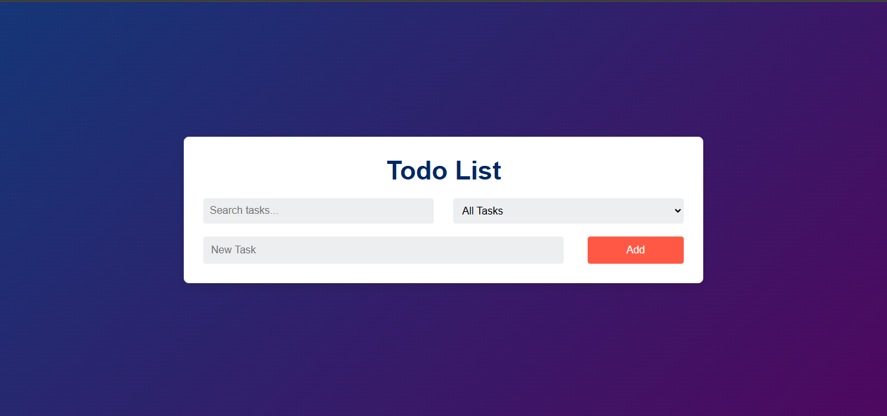

# To-do List Project

Aplikasi Todo List untuk mengelola tugas secara sederhana Dibuat menggunakan PHP, JavaScript, dan CSS. Aplikasi ini memungkinkan untuk menambah, menandai sebagai selesai, dan menghapus tugas. Fitur pencarian dan filter juga tersedia untuk memudahkan pengelolaan tugas berdasarkan status atau kata kunci.

## Screenshots

## Features

- Menambah Tugas: Tambahkan tugas baru ke daftar.
- Mencari Tugas: Cari tugas berdasarkan kata kunci.
- Memfilter Tugas: Tampilkan tugas berdasarkan status  (semua, selesai, atau belum selesai).
- Menandai Tugas sebagai Selesai: Tandai tugas yang sudah selesai.
- Menghapus Tugas: Hapus tugas yang tidak diperlukan.

