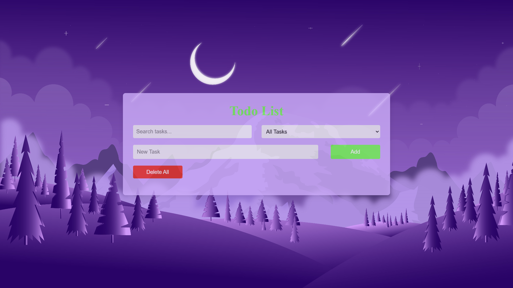

# UTS PEMROGRAMAN BERBASIS WEB

**Nama Legkap**: Muhammad Ghianza Al Ghifari  
**Nim**: 220660121058  
**Kelas**: IF-VD  
**Dosen Pengampu**: Yanyan Sofiyan, S.Kom., M.Kom.

# Aplikasi Todo List

Sebuah Aplikasi **Todo List** berbasis web yang sederhana untuk membantu pengguna mengelola tugas mereka dengan mudah. Aplikasi ini memiliki fitur seperti menambah, menampilkan, pencarian, filter, menandai tugas selesai, dan menghapus tugas.

## Screenshots

## Fitur

- **Tambah Tugas:** Tambahkan tugas baru ke daftar.
- **Cari Tugas:** Cari tugas dengan cepat menggunakan kata kunci.
- **Filter Tugas:** Filter tugas berdasarkan status (Semua, Selesai, atau Belum Selesai).
- **Tandai Selesai:** Ubah status tugas menjadi selesai atau belum selesai.
- **Hapus Semua Tugas:** Hapus seluruh daftar tugas sekaligus.

## Struktur Proyek

Proyek ini terdiri dari beberapa file:

1. **HTML (listTodos.php):**  
   Struktur utama aplikasi.

2. **CSS (style.css):**  
   Menangani gaya tampilan dan desain responsif aplikasi.

3. **JavaScript (script.js):**  
   Menyediakan fungsionalitas seperti menambah tugas, filter, pencarian, dan menghapus tugas.

## Cara Instalasi dan Penggunaan

1. Unduh file proyek atau clone repositori ini.
2. Pastikan Anda memiliki server lokal seperti XAMPP atau WAMP untuk menjalankan file `.php`.
3. Letakkan proyek ini di folder `htdocs` (untuk XAMPP).
4. Buka browser Anda dan navigasikan ke `http://localhost/{nama-folder-proyek}/listTodos.php`.

## Cara Menggunakan

1. Buka aplikasi di browser Anda.
2. Gunakan kolom input untuk menambahkan tugas.
3. Gunakan kolom pencarian untuk mencari tugas tertentu.
4. Gunakan dropdown filter untuk memfilter tugas berdasarkan status.
5. Klik pada tugas untuk menandainya sebagai selesai atau belum selesai.
6. Gunakan tombol "Hapus Semua" untuk menghapus seluruh daftar tugas. (Dalam Pengembangan)

## Teknologi yang Digunakan

- **HTML & PHP:** Untuk membuat struktur aplikasi.
- **CSS:** Untuk gaya tampilan dan desain responsif.
- **JavaScript:** Untuk memberikan interaktivitas dan fungsi di sisi klien.

## Rencana Pengembangan

- Menambahkan database untuk menyimpan data tugas secara permanen.
- Implementasi autentikasi pengguna untuk pengelolaan tugas yang lebih personal.
- Peningkatan antarmuka dengan animasi dan tema tambahan.

## Penulis

Dibuat oleh [Muhammad_Ghianza_Al_Ghifari]. Jangan ragu untuk menghubungi saya jika memiliki saran atau masukan untuk pengembangan aplikasi ini.

---

Terima kasih telah menggunakan Aplikasi Todo List!
